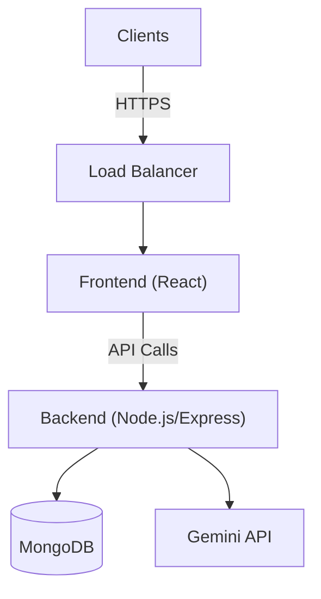
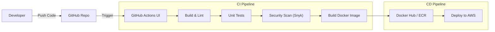

# DevOps Documentation for Sprint 2 - SecureCare

## 1. Overview
This document outlines the DevOps strategy, tools, and implementation plan for the **SecureCare** project for Sprint 2. The goal is to establish a robust CI/CD pipeline, containerize the application, and prepare for cloud deployment with monitoring and security best practices.

## 2. Tool Selection
Based on the project requirements and modern best practices:

*   **Version Control**: [GitHub](https://github.com/) (Centralized repository)
*   **CI/CD**: [GitHub Actions](https://github.com/features/actions) (Integrated with repository)
*   **Containers**: [Docker](https://www.docker.com/) (Standard for containerization)
*   **Orchestration**:
    *   **Local/Dev**: [Docker Compose](https://docs.docker.com/compose/)
    *   **Production**: [AWS ECS](https://aws.amazon.com/ecs/) or [Kubernetes](https://kubernetes.io/) (Planned for future sprints)
*   **IaC**: [Terraform](https://www.terraform.io/) (Infrastructure as Code for AWS)
*   **Cloud**: [AWS](https://aws.amazon.com/) (Primary cloud provider)
*   **Monitoring & Logging**: [Prometheus](https://prometheus.io/) & [Grafana](https://grafana.com/)
*   **Security**: [Snyk](https://snyk.io/) (Vulnerability scanning) & [SonarQube](https://www.sonarqube.org/) (Static code analysis)

---

## 3. Project Requirements

### 3.1 Functional Requirements
*   **Automated Builds**: Application builds automatically on code commit.
*   **CI Pipeline**: Automated tests executed in CI pipeline.
*   **Containerization**: Application containerized using Docker.
*   **Cloud Deployment**: Deployed to cloud environment (AWS).
*   **Observability**: Monitoring and logging enabled.

### 3.2 Non-Functional Requirements
*   **High Availability**: Designed for uptime and fault tolerance.
*   **Security**: Secure secrets management and vulnerability scanning.
*   **Rollback Strategy**: Ability to revert to previous stable versions.
*   **Code Quality**: Automated linting and static analysis.

---

## 4. Architecture Diagrams

### 4.1 High-Level Architecture


### 4.2 CI/CD Pipeline Flow


### 4.3 Deployment Flow
```mermaid
graph TD
    subgraph "CI/CD (GitHub Actions)"
        Code[Code Commit] --> Build[Build & Test]
        Build -->|Success| Image[Build Docker Image]
        Image -->|Push| Registry[Docker Registry (ECR/DockerHub)]
    end
    
    subgraph "Deployment (AWS)"
        Registry -->|Pull| Orchestrator[ECS / Kubernetes]
        Orchestrator -->|Deploy| Containers[App Containers]
        Containers -->|Health Check| LB[Load Balancer]
        LB -->|Traffic| Users[Live Traffic]
    end

    subgraph "Rollback Strategy"
        Monitor[CloudWatch Alarms] -->|Failure| Rollback[Revert to Previous Tag]
        Rollback --> Orchestrator
    end
```

---

## 5. Implementation Phases

### Phase 1: Planning & Setup
*   **Repository Setup**: GitHub repository initialized with main and feature branches.
*   **Branching Strategy**: **GitHub Flow** (Feature branches -> Pull Request -> dynamic checks -> Merge to main).
    *   `main`: Production-ready code.
    *   `develop`: Staging/Integration branch.
    *   `feature/*`: Individual feature development.
*   **Documentation**: Initial `DEVOPS.md` created.

### Phase 2: CI Pipeline
The CI pipeline is implemented using GitHub Actions. It triggers on `pull_request` to `main` and `develop`.

**Key Steps:**
1.  **Checkout Code**: Uses `actions/checkout`.
2.  **Setup Node.js**: Installs Node.js v18.
3.  **Install Dependencies**: `npm ci` for deterministic installs.
4.  **Linting**: `npm run lint` to ensure code quality.
5.  **Unit Tests**: `npm test` to verify functionality.
6.  **Security Scan**: Runs **Snyk** to check for vulnerabilities in dependencies.

### Phase 3: Containerization
We use Docker to containerize both the Frontend and Backend services.

#### Backend Dockerfile
```dockerfile
# backend/Dockerfile
FROM node:18-alpine

WORKDIR /app

COPY package*.json ./
RUN npm install --production

COPY . .

EXPOSE 5000
CMD ["npm", "start"]
```

#### Frontend Dockerfile
```dockerfile
# frontend/Dockerfile
FROM node:18-alpine as build

WORKDIR /app

COPY package*.json ./
RUN npm install

COPY . .
RUN npm run build

# Serve with Nginx
FROM nginx:alpine
COPY --from=build /app/dist /usr/share/nginx/html
EXPOSE 80
CMD ["nginx", "-g", "daemon off;"]
```

#### Docker Compose (Local Development)
```yaml
# docker-compose.yml
version: '3.8'
services:
  backend:
    build: ./backend
    ports:
      - "5000:5000"
    environment:
      - MONGO_URI=mongodb://mongo:27017/securecare
    depends_on:
      - mongo

  frontend:
    build: ./frontend
    ports:
      - "3000:80"
    depends_on:
      - backend

  mongo:
    image: mongo:latest
    ports:
      - "27017:27017"
    volumes:
      - mongo-data:/data/db

volumes:
  mongo-data:
```

### Phase 4: CD & Deployment
*   **Infrastructure as Code (IaC)**: Terraform scripts will provision:
    *   AWS VPC, Subnets, Security Groups.
    *   EC2 Instances or ECS Cluster.
    *   MongoDB Atlas (or self-hosted Mongo on EC2).
*   **Automated Deployment**: GitHub Actions will:
    1.  Login to Docker Hub / AWS ECR.
    2.  Build and Push Docker images with semantic tags (e.g., `v1.0.0`, `latest`).
    3.  Update the ECS Service or SSH into EC2 to pull and restart containers.

### Phase 5: Monitoring & Security & Logging
*   **Logging**: Centralized logging using **ELK Stack** (Elasticsearch, Logstash, Kibana) or AWS CloudWatch.
*   **Metrics**: **Prometheus** scrapes metrics from the backend (via `prom-client`) and **Grafana** visualizes them (CPU, Memory, Request Latency).
*   **Security**:
    *   **Trivy**: Scans Docker images for OS vulnerabilities.
    *   **SonarQube**: Continuous code quality and security inspection.
    *   **Secrets Management**: Using GitHub Secrets for CI/CD and AWS Secrets Manager for production runtime.

---

## 6. Deliverables Checklist
- [x] Version Control (GitHub) Status: **Active**
- [ ] CI/CD Pipeline (`.github/workflows/ci.yml`) Status: **Drafted**
- [ ] Dockerfiles (Frontend/Backend) Status: **Drafted**
- [ ] Infrastructure Code (Terraform) Status: **Pending**
- [ ] Final Report Status: **Drafted (This Document)**

## 7. Known Issues & Improvements
*   **Current**: No automated rollback strategy yet (planned for Sprint 3).
*   **Improvement**: Implement Blue/Green deployment to minimize downtime.
*   **Improvement**: Add end-to-end (E2E) testing with Cypress in the CI pipeline.

## 8. Bonus / Advanced Strategy
*   **Cost Optimization**: Use AWS Spot Instances for non-critical workloads.
*   **Auto-Scaling**: Configure AWS Auto Scaling Groups (ASG) based on CPU/Memory usage.
*   **Disaster Recovery**: Automated database backups to S3 with cross-region replication.
